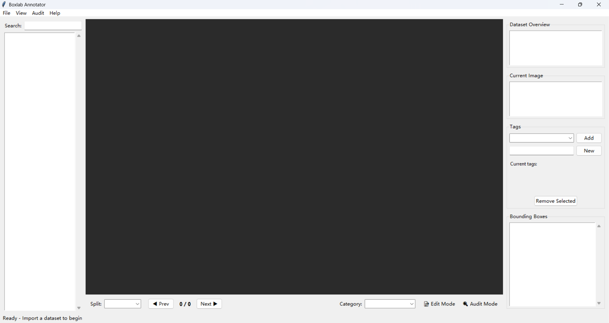

# Annotator Command

The `boxlab annotator` command launches the interactive GUI application for viewing, editing, and auditing object detection datasets.

## Overview

The annotator provides a complete desktop interface for dataset management with features including:

- Visual annotation editing
- Multi-split navigation
- Audit workflows
- Image tagging
- Workspace persistence
- Auto-backup

## Basic Usage

```bash
boxlab annotator
```

No arguments required. The command opens the GUI application.

## Alternative Methods

### As Python Module

```bash
python -m boxlab annotator
```

### With Poetry (Development)

```bash
poetry run boxlab annotator
```

### Direct Python Import

```python
from boxlab.annotator import AnnotatorApp

app = AnnotatorApp()
app.run()
```

## Application Interface

### Layout Overview

<div style="display:grid;grid-template-rows:36px 380px 52px 28px;grid-template-columns:1fr 2fr 1fr;gap:0;border:1px solid #444;font-family:'Segoe UI',sans-serif;font-size:14px;max-width:1200px;margin:24px 0;background:#1e1e1e;">
  <!-- Menu Bar -->
  <div style="font-size:12px;grid-column:1/4;padding:10px 16px;background:#2d2d2d;color:#e0e0e0;border-bottom:1px solid #444;">
    File | View | Audit | Help
  </div>

  <!-- Left Panel -->
  <div style="padding:16px;background:#252525;color:#d0d0d0;border-right:1px solid #444;">
    <div style="font-weight:600;margin-bottom:8px;color:#e0e0e0;">Image List Panel</div>
    <div style="font-size:12px;line-height:1.6;color:#a0a0a0;">
      Browse images<br>
      Filter by status<br>
      Split selector
    </div>
  </div>

  <!-- Center Canvas -->
  <div style="padding:16px;background:#1e1e1e;color:#d0d0d0;">
    <div style="font-weight:600;margin-bottom:8px;color:#e0e0e0;">Canvas</div>
    <div style="font-size:12px;line-height:1.6;color:#a0a0a0;">
      Annotation display<br>
      Interactive editing
    </div>
  </div>

  <!-- Right Panel -->
  <div style="padding:16px;background:#252525;color:#d0d0d0;border-left:1px solid #444;">
    <div style="font-weight:600;margin-bottom:8px;color:#e0e0e0;">Info Panel</div>
    <div style="font-size:12px;line-height:1.6;color:#a0a0a0;">
      Metadata<br>
      Tags<br>
      Statistics<br>
      Audit info
    </div>
  </div>

  <!-- Control Panel -->
  <div style="grid-column:1/4;padding:14px 16px;background:#2a2a2a;color:#e0e0e0;border-top:1px solid #444;border-bottom:1px solid #444;">
    <span style="font-weight:600;font-size:15px;margin-right:24px;">Control Panel</span>
    <span style="font-size:13px;color:#b0b0b0;">Prev | Split | Next | Edit Mode | Category | Audit Controls</span>
  </div>

  <!-- Status Bar -->
  <div style="grid-column:1/4;padding:6px 16px;background:#2d2d2d;color:#a0a0a0;font-size:12px;">
    Status: Ready
  </div>
</div>


*The BoxLab Annotator interface showing all main components*

### Components

**Image List Panel (Left)**
- Browse all images in current split
- Filter by audit status
- Search functionality
- Visual status indicators

**Canvas (Center)**
- Display images with annotations
- Edit bounding boxes
- Zoom and pan controls
- Selection and resizing

**Control Panel (Center Bottom)**
- Navigation buttons
- Split selector
- Edit mode toggle
- Category selector
- Audit controls

**Info Panel (Right)**
- Image metadata
- Annotation statistics
- Tag management
- Audit information

**Status Bar (Bottom)**
- Current operation status
- Active image information
- Modification indicators

## Keyboard Shortcuts

### Navigation

```
←                 Previous image
→                 Next image
```

### View

```
Ctrl + Mouse Wheel    Zoom in/out
Mouse Wheel           Scroll vertically
Shift + Mouse Wheel   Scroll horizontally
Ctrl + 0              Reset zoom
Middle Mouse Drag     Pan view
```

### Editing

```
Delete                Delete selected annotation
Ctrl + Z              Undo last change
Right Click           Show context menu
Drag Corners          Resize diagonally
Drag Edges            Resize horizontally/vertically
Click BBox            Select annotation
```

### Audit

```
F1                    Approve current image
F2                    Reject current image
```

### File Operations

```
Ctrl + O              Open workspace
Ctrl + S              Save workspace
Ctrl + Shift + S      Save workspace as
Alt + F4              Exit application
```

## Workflows

### Import and Browse

1. Launch annotator:

```bash
boxlab annotator
```

2. Import dataset:
    - File → Import Dataset...
    - Select format (COCO/YOLO/Raw)
    - Choose path
    - Select splits
    - Optionally add initial tags

3. Browse images:
    - Use arrow keys or image list
    - Switch splits with dropdown
    - View annotations and metadata

### Annotation Editing

1. Enable Edit Mode:
    - Click "Edit Mode" toggle in Control Panel
    - Or use checkbox in menu

2. Create annotations:
    - Select category from dropdown
    - Click and drag on canvas
    - Release to create bounding box

3. Edit annotations:
    - Click to select
    - Drag corners for diagonal resize
    - Drag edges for horizontal/vertical resize
    - Drag center to move (if enabled)

4. Delete annotations:
    - Select annotation
    - Press Delete key
    - Or right-click → Delete

5. Save changes:
    - File → Save Workspace (Ctrl+S)

### Audit Workflow

1. Enable Audit Mode:
    - Check "Audit Mode" in Control Panel
    - Audit controls become visible

2. Review image:
    - Check annotations for correctness
    - Verify bounding box quality
    - Assess image quality

3. Make decision:
    - Press F1 to approve
    - Press F2 to reject
    - Add comment (optional)
    - Automatically moves to next

4. Track progress:
    - View statistics in Info Panel
    - Use audit filter in Image List
    - Generate report when complete

5. Export audit report:
    - Audit → Export Audit Report...
    - Save as JSON file

### Workspace Management

**Saving Workspace:**

```bash
# First save (creates .cyw file)
File → Save Workspace As... (Ctrl+Shift+S)

# Subsequent saves
File → Save Workspace (Ctrl+S)
```

**Loading Workspace:**

```bash
# Open existing workspace
File → Open Workspace... (Ctrl+O)

# Select .cyw file
# Complete state is restored
```

**Workspace Contents:**

- Dataset structure
- All annotations (original + edits)
- Audit status and comments
- Image tags
- Current view state
- Split organization

### Export Dataset

1. Make changes to dataset (annotations, audits, tags)

2. Export:
    - File → Export Dataset...
    - Select format (COCO/YOLO)
    - Choose output directory
    - Select naming strategy
    - Configure options

3. Options:
    - Copy images: Yes/No
    - Naming strategy: original/uuid/sequential/etc.
    - Unified structure (YOLO)

4. Audit mode exports:
    - Includes audit_report.json
    - Filter by audit status (optional)

## Features

### Image Tagging

**Add tags:**

1. Select image
2. In Info Panel → Tags section
3. Type tag name
4. Press Enter or click Add

**Create new tag:**

1. Type new tag name
2. Click "Create New Tag"
3. Tag becomes available for all images

**Remove tags:**

1. Click × on tag in current tags
2. Tag removed from image

**Tag uses:**

- Organize images by topic
- Mark images for review
- Filter in image list
- Export subsets

### Audit System

**Audit Status:**

- **Pending**: Not yet reviewed (gray)
- **Approved**: Passed review (green ✓)
- **Rejected**: Failed review (red ✗)

**Audit Filter:**

- Show All
- Show Pending Only
- Show Approved Only
- Show Rejected Only

**Audit Comments:**

- Add notes for each image
- Explain rejection reasons
- Track review decisions
- Included in report

**Audit Report:**

- Total images
- Approved/Rejected/Pending counts
- Per-image details
- Comments
- Timestamps
- JSON format for processing

### Auto-Backup

Automatic backup triggers:

- Uncaught exceptions
- Application crashes
- Critical errors

Backup location:

```
~/.boxlab/backups/
```

Backup contents:

- Full workspace state
- All annotations
- Audit information
- Tags

Recovery:

```bash
# Launch annotator
boxlab annotator

# Open backup
File → Open Workspace...
# Navigate to ~/.boxlab/backups/
# Select backup file
```

## Integration with CLI

### Import → Edit → Export Pipeline

```bash
# 1. Import dataset
boxlab annotator
# File → Import → Select COCO dataset

# 2. Edit annotations
# Make changes in GUI

# 3. Save workspace
# File → Save Workspace As → project.cyw

# 4. Export
# File → Export → Select YOLO format
```

### Merge → Review → Export Pipeline

```bash
# 1. Merge datasets via CLI
boxlab dataset merge \
  -i data/ds1.json coco \
  -i data/ds2.json coco \
  -o data/merged

# 2. Review in annotator
boxlab annotator
# File → Import → Load merged dataset

# 3. Verify quality
# Enable audit mode
# Review images

# 4. Export final
# File → Export → Select format
```

### Convert → Verify → Audit Pipeline

```bash
# 1. Convert format via CLI
boxlab dataset convert input.json -if coco output -of yolo

# 2. Verify in annotator
boxlab annotator
# File → Import → Load converted dataset

# 3. Audit for errors
# Enable audit mode
# Check conversions

# 4. Re-export if needed
# File → Export
```

## Tips and Best Practices

### 1. Save Frequently

```bash
# Use Ctrl+S regularly
# Auto-backup only activates on crashes
```

### 2. Use Audit Mode for Quality Control

```bash
# After importing:
1. Enable Audit Mode
2. Review systematically
3. Mark issues
4. Export report
5. Fix issues
6. Re-audit
```

### 3. Organize with Tags

```bash
# Create tag system:
- quality:high, quality:low
- source:camera1, source:camera2
- status:needs_review
- difficulty:hard
```

### 4. Leverage Workspaces

```bash
# Save intermediate states:
project_initial.cyw       # After import
project_annotated.cyw     # After annotation
project_audited.cyw       # After audit
project_final.cyw         # Before export
```

### 5. Use Keyboard Shortcuts

```bash
# Efficient navigation:
→ to next
F1 to approve
F2 to reject
→ to next (automatically)

# Fast audit:
Review → F1/F2 → Next → Repeat
```

### 6. Zoom for Precision

```bash
# Small annotations:
Ctrl + Mouse Wheel to zoom in
Edit with precision
Ctrl + 0 to reset
```

### 7. Filter Smart

```bash
# Image list filters:
- Filter by split
- Filter by audit status
- Search by filename
- Combine filters
```

## Reference

- [Annotator API](../reference/annotator.md) - API documentation
- [CLI Overview](cli-overview.md) - General CLI guide
